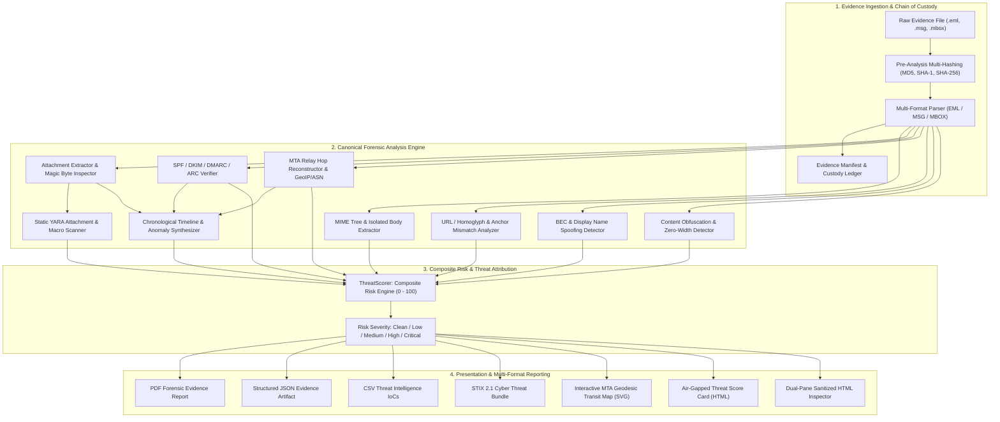

# Email Forensic Tool (EFT)

<div align="center">

[](https://opensource.org/licenses/MIT)
[](https://www.python.org/)
[](https://github.com/iaditya8/Email-Forensic-Tool-EFT/releases)
[](tests/)
[](tests/)
[](docs/EVIDENCE_INTEGRITY.md)

**An enterprise-grade Digital Forensics and Incident Response (DFIR) suite for email parsing, MTA transit hop reconstruction, cryptographic authentication analysis, phishing detection, threat scoring, and court-defensible evidence reporting.**

[Key Features](#-key-features) • [Architecture](#-system-architecture) • [Quick Start](#-quick-start--python-api) • [Roadmap](#-completed-phases--epics) • [Integrity](#-evidence-integrity--chain-of-custody) • [Installation](#-installation--setup)

</div>

---

## 📌 Overview

**Email Forensic Tool (EFT)** is an enterprise-grade DFIR solution designed to empower digital forensic investigators, SOC analysts, and incident responders with an end-to-end platform for dissecting electronic communications.

Unlike basic mail viewers, EFT treats every input as critical digital evidence. It enforces strict **read-only forensic immutability** (ISO/IEC 27037), computes multi-algorithm cryptographic digests (MD5, SHA-1, SHA-256), deconstructs nested MIME trees, traces transmission relays across global networks with GeoIP intelligence, evaluates email anti-spoofing controls (SPF, DKIM, DMARC, ARC), executes static YARA malware scans, computes composite risk scores (0-100 dial), and outputs court-admissible forensic reports in PDF, JSON, CSV, and STIX 2.1 formats.

---

## 🎯 Key Features

### 1. Ingestion & Evidence Preservation
* **Multi-Format Ingestion:** Native parsers for `.eml` (RFC 822/5322), `.msg` (Microsoft Outlook OLE Compound Binary), and `.mbox` (RFC 4155 Unix mailbox archives).
* **Forensic Immutability (Zero-Byte Mutation):** Strict read-only stream access with pre/post-analysis multi-hash comparison to guarantee evidence integrity.
* **MIME Tree Decomposer:** Hierarchical decomposition of complex multi-part structures (`multipart/mixed`, `multipart/related`, `multipart/alternative`, nested `message/rfc822`).
* **Attachment Extraction & Magic Inspection:** Automatic payload extraction with cryptographic digests (MD5, SHA-1, SHA-256) and true file-type magic byte validation to uncover double-extension spoofing (e.g. `invoice.pdf.exe`).

### 2. Header & Network Transit Forensics
* **Hop-by-Hop Relay Reconstruction:** Chronological reconstruction of Mail Transfer Agent (MTA) traversal from origin to recipient.
* **Latency & Anomaly Detection:** Real-time delay calculation to detect clock drift, time-travel anomalies, and forged hops.
* **Network Intelligence:** GeoIP coordinates, ASN classification, cloud provider detection (AWS, Azure, GCP, Cloudflare), and Tor exit node / VPN proxy flagging.
* **Multi-Protocol Authentication:** Automated verification of **SPF**, **DKIM** (selector validation & key evaluation), **DMARC** policy alignment, and **ARC** (Authenticated Received Chain).

### 3. Phishing, BEC & Content Forensics
* **URL Extraction & Defanging:** Complete hyperlink harvesting, anchor-text mismatch detection (`href` targeting different host than anchor text), and safe defanging (`hxxp[://]...`).
* **IDN Homograph & Punycode Detection:** Detection of spoofed internationalized domain names (e.g., Cyrillic characters mimicking legitimate brands).
* **Business Email Compromise (BEC):** Executive/VIP impersonation detection, display name spoofing, and asymmetric routing (`From` vs `Reply-To` / `Return-Path`).
* **Obfuscation & Steganography Detection:** Identification of zero-width Unicode characters (`U+200B`), hidden CSS text (`display:none`, `font-size:0px`), and decoded Base64/Hex/URL-encoded payloads.
* **Static YARA Attachment Scanning:** DFIR rule engine detecting weaponized VBA macros, PDF action exploits (`/Launch`, `/JavaScript`), executable binaries, and EICAR test payloads.

### 4. Evidence Integrity, Timelines & Reporting
* **Cryptographic Chain of Custody:** Immutable evidence ledger (`EvidenceLedger`) tracking case ID, examiner identity, acquisition timestamps, and event logs.
* **Chronological Timeline Synthesis:** Standardized UTC event sequence tracing creation, MTA transit hops, DKIM signatures, attachment extractions, and anomalies.
* **Court-Ready Multi-Format Exports:**
  * **PDF:** Executive forensic report with speedometer dials, MTA hop tables, and examiner certification statements.
  * **JSON:** Loss-free structured schema for automation and archival.
  * **CSV:** Tabular Indicators of Compromise (IoCs) formatted for SIEM/SOAR ingestion.
  * **STIX 2.1:** Standardized CTI bundles for threat intelligence sharing.

### 5. UI/UX & Visual Analytics
* **Dual-Pane Email Inspector:** Air-gapped visual HTML sanitizer neutralizing JavaScript, dynamic scripts, and tracking pixels.
* **MTA Geodesic Transit Map:** Interactive vector world map rendering global MTA transit hops with geodesic flight paths and anomaly highlights.
* **Composite Threat Score Card (0-100):** Visual risk dial, breakdown bars, and Mermaid factor trees for immediate triage.

---

## 🏛 System Architecture



---

## 🚀 Quick Start & Python API

### End-to-End Forensic Analysis Example

```python
from pathlib import Path
from eft.ingestion.engine import EmailIngester
from eft.ingestion.attachment_extractor import AttachmentExtractor
from eft.analysis.auth_verifier import AuthenticationVerifier
from eft.analysis.relay_analyzer import RelayAnalyzer
from eft.analysis.network_intelligence import NetworkIntelligenceService
from eft.analysis.url_analyzer import URLAnalyzer
from eft.analysis.bec_detector import BECDetector
from eft.analysis.obfuscation_detector import ContentObfuscationDetector
from eft.analysis.attachment_scanner import AttachmentThreatScanner
from eft.analysis.threat_scorer import ThreatScorer
from eft.reporting.custody import ChainOfCustodyManager
from eft.reporting.exporter import ForensicReportExporter
from eft.reporting.timeline import TimelineGenerator

# 1. Initialize Chain of Custody Manifest
evidence_file = Path("evidence/suspicious_email.eml")
manifest = ChainOfCustodyManager.create_manifest(
    file_path=evidence_file,
    case_id="CASE-2026-DFIR-001",
    evidence_id="EVID-001",
    examiner_name="Special Agent Smith",
)
ledger = ChainOfCustodyManager.create_ledger(manifest)

# 2. Ingest Evidence (Zero Mutation Guarantee)
ingester = EmailIngester()
result = ingester.ingest_file(evidence_file)
email = result.messages[0]

# 3. Extract & Inspect Attachments
extracted_atts = AttachmentExtractor.extract_from_email(
    email, output_dir="output/attachments", save_to_disk=True
)

# 4. Multi-Vector Forensic Analysis
auth_report = AuthenticationVerifier.verify_email(email)
transit_route = RelayAnalyzer.reconstruct_route(email.header_decomposition.received_headers)
net_service = NetworkIntelligenceService()
email.transit_route = net_service.enrich_route(transit_route)

email.url_report = URLAnalyzer().extract_urls(email)
email.bec_report = BECDetector().detect(email)
email.obfuscation_report = ContentObfuscationDetector().detect(email)
email.attachment_threat_report = AttachmentThreatScanner().scan_email(email)
email.timeline_report = TimelineGenerator.generate_timeline(email)

# 5. Calculate Composite Threat Score (0 - 100)
risk_report = ThreatScorer.calculate_composite_risk(email)
print(f"Risk Score: {risk_report.overall_score}/100 [{risk_report.risk_level.value}]")
print(f"Recommended Action: {risk_report.recommended_action}")

# 6. Export Multi-Format Evidence Reports
exports = ForensicReportExporter.export_all(
    email,
    output_dir="output/reports",
    case_id="CASE-2026-DFIR-001",
    examiner_name="Special Agent Smith",
)
print("Reports generated:", exports)
```

---

## 🗺 Completed Phases & Epics

All 5 core epics, 15 sub-tasks, and the forensic corpus benchmarking suite are 100% complete and validated:

| Epic / Phase | Key Capabilities | Status |
| :--- | :--- | :---: |
| **Phase 1: Ingestion & Core Parsing** | Ingest `.eml`, `.msg`, `.mbox`, MIME decomposition, attachment hashing & magic inspection | ✅ 100% |
| **Phase 2: Header & Auth Analysis** | Relay hop reconstruction, MTA latency, GeoIP/ASN network intel, SPF/DKIM/DMARC/ARC | ✅ 100% |
| **Phase 3: Threat & Content Forensics** | URL defanging, IDN homoglyphs, BEC executive impersonation, zero-width steganography, YARA scanner | ✅ 100% |
| **Phase 4: Custody, Timelines & Reports** | Evidence ledger, UTC chronological timeline with anomaly detection, PDF/JSON/CSV/STIX 2.1 exporters | ✅ 100% |
| **Phase 5: UI/UX & Visualization** | Dual-pane air-gapped inspector, SVG geodesic transit map, composite threat score card | ✅ 100% |
| **Benchmark & Realistic Corpus** | 7 forensic scenarios (Benign, Phishing, BEC, Malware, Zero-Width, Transit Tor, MBOX) & latency benchmarks | ✅ 100% |

---

## 🔒 Evidence Integrity & Chain of Custody

Digital forensic defensibility mandates that evidence remains unaltered:
1. **Strict Read-Only Access:** Ingestion streams open source files with binary read-only access.
2. **Dual-Phase Multi-Hashing:** MD5, SHA-1, and SHA-256 hashes are calculated upon initial intake and compared after analysis to guarantee `0-byte` mutation.
3. **Audit Ledger:** Every analytical run produces an immutable `EvidenceLedger` recording case metadata, examiner identity, timestamps, and cryptographic proofs.

For full technical specifications, see [docs/EVIDENCE_INTEGRITY.md](docs/EVIDENCE_INTEGRITY.md).

---

## 💻 Installation & Setup

### Prerequisites
* Python 3.10, 3.11, or 3.12
* Poetry (>= 2.0.0) or pip

### Installation via Poetry
```bash
# Clone the repository
git clone https://github.com/iaditya8/Email-Forensic-Tool-EFT.git
cd Email-Forensic-Tool-EFT

# Install dependencies with Poetry
poetry install

# Run the test suite with strict coverage verification
poetry run pytest --cov=src/eft --cov-report=term-missing --cov-fail-under=80
```

### Running Linters & Type Checks
```bash
poetry run ruff check .
poetry run ruff format --check .
poetry run mypy src tests
```

---

## 📄 License

This project is licensed under the **MIT License** - see the [LICENSE](LICENSE) file for details.
