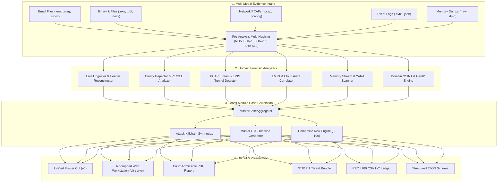

# Email Forensic Tool (EFT) — Master DFIR Workstation

<div align="center">

[](https://opensource.org/licenses/MIT)
[](https://www.python.org/)
[](https://github.com/iaditya8/Email-Forensic-Tool-EFT/releases)
[](tests/)
[](tests/)
[](docs/ROADMAP.md)

**Enterprise-Grade Digital Forensics & Incident Response (DFIR) Platform for Multi-Modal Evidence Aggregation, Email Analysis, Network PCAPs, Event Logs, Memory Triage, Binary Inspection, and Court-Admissible Reporting.**

[Key Modules](#-key-forensic-modules) • [System Architecture](#-system-architecture) • [CLI Commands](#-unified-command-line-interface) • [Web Workstation](#-air-gapped-web-workstation) • [Python API](#-python-sdk--programmatic-usage) • [Evidence Integrity](#-cryptographic-evidence-integrity) • [Installation](#-installation--setup)

</div>

---

## 📌 Overview

**Email Forensic Tool (EFT)** is a pure-Python, air-gapped Digital Forensics & Incident Response (DFIR) workstation. Engineered for incident responders, SOC analysts, and legal examiners, EFT unifies analysis across six foundational forensic domains into a single, cohesive case ledger.

Every ingested artifact is processed under strict **ISO/IEC 27037 read-only immutability**, verified by pre- and post-analysis multi-algorithm cryptographic hashing (`MD5`, `SHA-1`, `SHA-256`, `SHA-512`). Cross-evidence correlation automatically uncovers shared infrastructure, lateral movement, credential theft, and multi-stage attack killchains.

---

## 🎯 Key Forensic Modules

```
                                  ┌────────────────────────────────┐
                                  │   EFT Master DFIR Engine       │
                                  └────────────────┬───────────────┘
          ┌─────────────────┬──────────────────────┼──────────────────────┬──────────────────┐
          │                 │                      │                      │                  │
    ┌─────▼──────┐   ┌──────▼──────┐        ┌──────▼──────┐        ┌──────▼──────┐    ┌──────▼──────┐
    │   Email    │   │  Binaries   │        │   Network   │        │ Event Logs  │    │   Memory    │
    │  Analysis  │   │  & Artifacts│        │    PCAP     │        │ EVTX / Cloud│    │   Triage    │
    └────────────┘   └─────────────┘        └─────────────┘        └─────────────┘    └─────────────┘
          │                 │                      │                      │                  │
          └─────────────────┴──────────────────────┼──────────────────────┴──────────────────┘
                                                   │
                                     ┌─────────────▼──────────────┐
                                     │  Unified Case Aggregator   │
                                     │  & Court-Ready Exporters   │
                                     │  (PDF / STIX / CSV / JSON) │
                                     └────────────────────────────┘
```

### 1. Email Forensic Engine (`eft email`)
* **Multi-Format Parsers**: RFC 822/5322 `.eml`, Microsoft Outlook OLE Compound Binary `.msg`, and RFC 4155 Unix `.mbox` archives.
* **MTA Hop Reconstruction**: Chronological parsing of `Received` headers with latency tracking, clock drift alerts, and geodesic map visualization.
* **Authentication Auditing**: Multi-protocol verification of SPF, DKIM (cryptographic selector and RSA key evaluation), DMARC alignment, and ARC chains.
* **Phishing & BEC Detection**: IDN homograph punycode detection, anchor-text mismatch identification, display-name spoofing, and zero-width Unicode steganography.
* **Payload Inspection**: Recursive MIME tree extraction, magic byte mismatch detection, and static YARA attachment scanning.

### 2. File & Binary Static Inspector (`eft file`)
* **Magic Byte Engine**: Byte-level header and offset signature validation across 100+ binary, document, archive, and executable formats.
* **Deception Detection**: Flags double extensions (e.g. `document.pdf.exe`), null byte injection, and Unicode Right-to-Left Override (RLO) attacks.
* **PE32/PE32+ Dissection**: Section table analysis, section entropy calculations for packer detection, and suspicious Windows API import mapping.
* **OLE / VBA Macro Engine**: Extracts and categorizes weaponized macros, auto-exec hooks (`AutoOpen`, `Workbook_Open`), and shell execution triggers.
* **Deep Metadata Extraction**: EXIF geolocation and camera tags from images, PDF revision trees and incremental update histories, and media metadata.

### 3. Domain & IP OSINT Engine (`eft osint`)
* **Passive DNS & WHOIS**: Offline registrar and creation date auditing, domain age calculations, and MX/SPF/DKIM/DMARC hygiene assessment.
* **MaxMind GeoIP Integration**: Resolves IP addresses to autonomous system numbers (ASN), ISP organizations, country codes, and city coordinates.
* **Threat Intelligence Matching**: Instant correlation against local IoC watchlists and known malicious C2 feeds.

### 4. Network PCAP Forensics (`eft pcap`)
* **Wire-Speed Dissection**: Analyzes `.pcap` and `.pcapng` packet captures across IPv4, IPv6, TCP, UDP, DNS, HTTP, and TLS handshakes.
* **DNS Covert Channel Detection**: Calculates Shannon entropy per domain label and monitors query velocity to detect DNS tunneling and data exfiltration.
* **Cleartext Credential Extraction**: Sniffs and defangs unencrypted HTTP Basic/Bearer auth headers, FTP credentials, Telnet sessions, and SMTP/IMAP logins.

### 5. Windows & Cloud Log Correlator (`eft log`)
* **Windows Security & Sysmon (EVTX)**: Parses Windows Event Logs for logon types (Interactive, Network, RDP), brute force attacks, service installations (Event 7045), scheduled tasks (Event 4698), and privilege escalation (Event 4672).
* **Cloud Audit Logs**: Parses Microsoft 365 Unified Audit Logs and Google Workspace Admin logs to detect malicious inbox rules, external mail forwarding, and illicit OAuth consent grants.

### 6. Volatile Memory Dump Triage (`eft mem`)
* **Streaming Raw Memory Parser**: Ingests multi-gigabyte RAM dumps (`.raw`, `.dmp`, `.vmem`) in streaming memory-mapped blocks with minimal RAM footprint.
* **In-Memory IoC Matcher**: Scrapes volatile RAM for IPv4/IPv6 addresses, URLs, unencrypted tokens, private keys, and cryptocurrency wallet addresses.
* **Memory YARA Attribution**: Scans memory segments for C2 beacon signatures (Cobalt Strike, Meterpreter, Mimikatz, Lumma Stealer) and reflective DLL injections.

### 7. Unified Case Ledger & Master Case Report (`eft case`)
* **Zero-Byte Mutation Assurance**: Dual pre- and post-analysis multi-hashing (`MD5`, `SHA-1`, `SHA-256`, `SHA-512`) verifying ISO/IEC 27037 compliance.
* **Cross-Evidence Correlation**: Unifies IoCs across all ingested artifacts into an end-to-end attack killchain.
* **Court-Admissible Exports**: Generates executive PDF reports with legal certifications, STIX 2.1 Threat Intelligence Bundles, RFC 4180 CSV tables, and structured JSON schemas.

---

## 🏛 System Architecture



---

## 💻 Unified Command-Line Interface

EFT provides a single, unified CLI binary (`eft`):

```bash
# General Syntax
eft <MODULE> <COMMAND> [OPTIONS] [ARGUMENTS]
```

### Module Commands

```bash
# 1. Email Forensics
eft email scan suspicious_email.eml --json
eft email report phish.msg --output report.pdf --format pdf
eft email map email_transit.eml --output map.html

# 2. File & Binary Inspection
eft file inspect payload.exe
eft file entropy sample.bin --graph
eft file exif document.pdf

# 3. Domain & IP OSINT Triage
eft osint lookup evil-c2-domain.com
eft osint ip 185.220.101.5

# 4. Network PCAP Analysis
eft pcap analyze capture.pcap
eft pcap dns dns_exfil.pcapng --threshold 3.8
eft pcap creds traffic.pcap

# 5. Windows & Cloud Event Logs
eft log evtx Security.evtx --user Administrator
eft log m365 audit_records.json

# 6. Volatile Memory Dump Triage
eft mem scan memory.raw --yara rules/malware.yar
eft mem strings memdump.dmp --min-len 8
eft mem iocs memory.vmem

# 7. Cross-Module Master Case Aggregation
eft case analyze email.eml payload.exe capture.pcap security.evtx --case-id CASE-2026-001
eft case report email.eml payload.exe capture.pcap -o final_case_report.pdf --format pdf

# 8. Air-Gapped Web Workstation
eft serve --host 127.0.0.1 --port 8000 --open
```

---

## 🌐 Air-Gapped Web Workstation

Launch the interactive, multi-modal web dashboard with a single command:

```bash
eft serve --port 8000 --open
```

### Dashboard Capabilities
* **Full Tab Navigation**: Switch seamlessly between **Email Workstation**, **File Inspector**, **OSINT Lookup**, **PCAP Analyzer**, **Log Correlator**, **Memory Scanner**, and **Master Case Report**.
* **Zero External Dependencies**: 100% self-contained Vanilla HTML5/CSS/JavaScript with embedded SVG rendering—no external CDN requests or internet connectivity required.
* **Interactive Visualizations**: Interactive MTA transit maps, risk dials, timeline charts, and packet breakdown tables.

---

## 🐍 Python SDK & Programmatic Usage

```python
from pathlib import Path
from eft.reporting.case_aggregator import MasterCaseAggregator
from eft.reporting.case_exporter import MasterCaseExporter

# 1. Initialize Master Case Aggregator
aggregator = MasterCaseAggregator(
    case_id="CASE-2026-DFIR-001",
    examiner_name="Special Agent J. Miller",
    examiner_agency="Digital Forensics Unit",
    case_title="Operation Phish-to-Egress Incident"
)

# 2. Ingest Evidence across multiple forensic domains
aggregator.add_evidence_file(Path("evidence/spearphish.eml"))
aggregator.add_evidence_file(Path("evidence/dropped_payload.exe"))
aggregator.add_evidence_file(Path("evidence/network_capture.pcap"))
aggregator.add_evidence_file(Path("evidence/Security.evtx"))

# 3. Correlate and Build Master Report
master_report = aggregator.correlate_and_build_report()

print(f"Overall Risk Score: {master_report.overall_composite_risk_score:.1f}/100")
print(f"Correlated IoCs: {len(master_report.master_ioc_ledger)}")
print(f"Total Timeline Events: {len(master_report.master_timeline)}")

# 4. Export Court-Admissible Reports
MasterCaseExporter.export_pdf(master_report, Path("exports/case_report.pdf"))
MasterCaseExporter.export_stix(master_report, Path("exports/stix_bundle.json"))
MasterCaseExporter.export_csv(master_report, Path("exports/iocs.csv"))
```

---

## 🔒 Cryptographic Evidence Integrity

EFT strictly enforces the **ISO/IEC 27037** standard for digital evidence handling:

1. **Pre-Analysis Hashing**: Before reading or analyzing any artifact, cryptographic hashes (`MD5`, `SHA-1`, `SHA-256`, `SHA-512`) are computed and recorded.
2. **Read-Only Stream Analysis**: Evidence is inspected in memory or via read-only stream handles.
3. **Post-Analysis Verification**: Hashes are re-computed upon analysis completion. Any discrepancy immediately raises an `EvidenceTamperedException` and halts the investigation pipeline.
4. **Audit Immutability Ledger**: Every export includes the complete cryptographic chain of custody with timestamped examiner sign-offs.

---

## 📦 Installation & Setup

### Prerequisites
* **Python**: `3.10`, `3.11`, or `3.12`
* **Poetry**: `^2.0.0` or standard `pip`

### Installation via Poetry (Recommended)
```bash
# Clone repository
git clone https://github.com/iaditya8/Email-Forensic-Tool-EFT.git
cd "Email Forensic Tool (EFT)"

# Install dependencies in virtual environment
poetry install

# Validate installation
poetry run eft --help
```

### Installation via Pip / Wheel
```bash
pip install dist/eft-2.0.0-py3-none-any.whl
```

---

## 🧪 Testing & Quality Gates

EFT enforces strict automated quality gates:

```bash
# Run full unit and integration test suite
poetry run pytest -v

# Run test suite with strict coverage enforcement (>=80%)
poetry run pytest --cov=eft --cov-report=term-missing --cov-fail-under=80

# Run Ruff linter and code formatter checks
poetry run ruff check src tests
poetry run ruff format --check src tests

# Run Mypy static type checker
poetry run mypy src tests
```

---

## 📄 License & Legal Notice

This project is licensed under the **MIT License** — see the [LICENSE](LICENSE) file for details.

*Disclaimer: Email Forensic Tool (EFT) is designed for authorized digital forensic investigations, defensive incident response, and academic research. Always ensure proper legal authorization and chain-of-custody protocols before analyzing digital evidence.*
