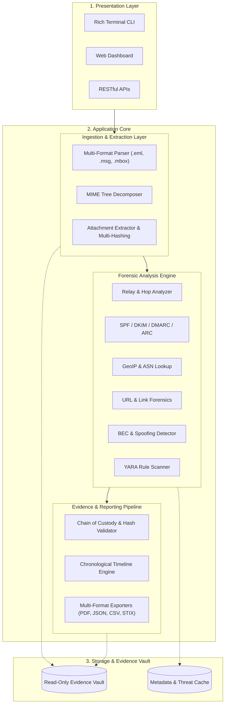
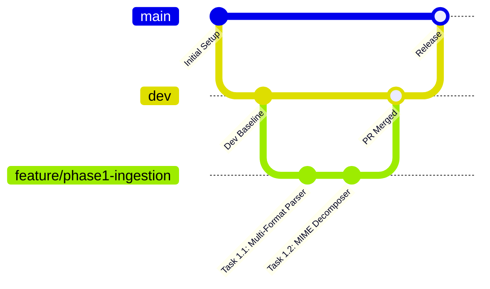

# Email Forensic Tool (EFT)

<div align="center">

[](https://opensource.org/licenses/MIT)
[](https://www.python.org/)
[](https://datatracker.ietf.org/doc/html/rfc5322)
[](#evidence-integrity--chain-of-custody)
[](#git-workflow--branching-strategy)

**An enterprise-grade Digital Forensics and Incident Response (DFIR) suite for email parsing, MTA transit hop reconstruction, cryptographic authentication analysis, phishing detection, and court-defensible evidence reporting.**

[Key Features](#-key-features) • [Architecture](#-system-architecture) • [Roadmap](#-phases--epics-roadmap) • [Installation](#-installation--setup) • [Workflow](#-git-workflow--branching-strategy) • [Integrity](#-evidence-integrity--chain-of-custody)

</div>

---

## 📌 Overview

**Email Forensic Tool (EFT)** is engineered to empower digital forensic investigators, SOC analysts, and incident responders with an end-to-end platform for dissecting suspicious electronic communications. 

Unlike conventional mail viewers, EFT treats every input as critical digital evidence. It enforces strict **read-only forensic immutability**, computes multi-algorithm cryptographic digests, deconstructs nested MIME trees, traces transmission relays across global networks, and evaluates anti-spoofing controls (SPF, DKIM, DMARC, ARC) to expose malicious campaigns.

---

## 🎯 Key Features

### 1. Ingestion & Evidence Preservation
* **Multi-Format Support:** Native parser for `.eml` (RFC 822/5322), `.msg` (Microsoft Outlook OLE/MAPI), and `.mbox` Unix archives.
* **Forensic Immutability:** Strict read-only stream access with pre/post analysis cryptographic verification to prevent tampering.
* **MIME Tree Decomposer:** Complete hierarchical mapping of complex multi-part structures (`multipart/mixed`, `multipart/related`, `multipart/alternative`).
* **Attachment Cryptography:** Extraction of all embedded payloads with simultaneous calculation of **MD5**, **SHA-1**, **SHA-256**, and **SSDEEP** fuzzy hashes.
* **Magic Byte Validation:** Binary signature inspection to detect extension masquerading (e.g. `.exe` disguised as `.pdf`).

### 2. Header & Network Transit Forensics
* **Hop-by-Hop Reconstruction:** Reverse-chronological traversal of `Received:` headers to reconstruct the true email transit trajectory.
* **Latency Calculation:** Delay computation between Mail Transfer Agents (MTAs) to uncover routing anomalies and timing manipulation.
* **Network Intelligence:** Extraction of originating and relay IPs with automated GeoIP resolution, ASN classification, and identification of VPNs/Tor nodes.
* **Authentication Verification:** Automated verification of **SPF**, **DKIM** (DNS public key retrieval & cryptographic signature checking), **DMARC** policy enforcement, and **ARC** (Authenticated Received Chain) validation.

### 3. Phishing, BEC & Threat Forensics
* **URL Extraction & Defanging:** Complete hyperlink harvesting, anchor-text mismatch detection (e.g., text displays legitimate domain while `href` targets malicious host), and automated URL defanging (`hxxp[://]...`).
* **IDN Homograph & Punycode Detection:** Detection of spoofed Cyrillic and unicode characters mimicking authentic brand names.
* **BEC & Display Name Spoofing:** Heuristic identification of executive impersonation, `From` vs. `Reply-To` / `Return-Path` mismatches, and Levenshtein domain distance analysis.
* **Obfuscation Detection:** Detection of zero-font sizes, white-on-white text, hidden CSS elements (`display: none`), and extraction of base64/hex blobs.
* **YARA Integration:** Modular static rule scanning against message bodies and extracted attachments.

### 4. Evidence Integrity, Timelines & Reporting
* **Chain of Custody Ledger:** Automatic creation of a verifiable `evidence_manifest.json` recording case details, examiner information, and file hashes.
* **Event Timeline:** Standardized UTC chronological timeline tracing generation, relay hops, and delivery timestamps.
* **Court-Ready Multi-Format Exports:**
  * **PDF:** Executive summary with risk scores, MTA hop paths, and indicators.
  * **JSON:** Comprehensive, machine-readable structured evidence model.
  * **CSV:** Tabular indicators of compromise (IOCs) for SIEM/SOAR ingestion.
  * **STIX 2.1:** Standardized threat intelligence bundle for automated indicator sharing.

---

## 🏛 System Architecture



For complete architectural details, see [docs/ARCHITECTURE.md](docs/ARCHITECTURE.md).

---

## 🗺 Phases & Epics Roadmap

The project is structured into 5 consecutive Phases (Epics), with each task tracking strict deliverables:

| Phase | Epic Name | Key Focus | Status |
| :--- | :--- | :--- | :---: |
| **Phase 1** | **Ingestion & Core Parsing** | Ingest `.eml`, `.msg`, `.mbox`, MIME decomposition, attachment hashing | 🟡 Planned |
| **Phase 2** | **Header & Auth Analysis** | Relay hops, MTA delays, GeoIP/ASN, SPF/DKIM/DMARC/ARC checks | ⚪ Backlog |
| **Phase 3** | **Threat & Phishing Forensics** | Link analysis, BEC detection, hidden content, YARA static scanner | ⚪ Backlog |
| **Phase 4** | **Chain of Custody & Reports** | Evidence manifest, chronological timeline, PDF/JSON/STIX exporters | ⚪ Backlog |
| **Phase 5** | **UI/UX & Visualization** | Dual-pane inspector, MTA transit map, threat scoring card | ⚪ Backlog |

For detailed task specifications and acceptance criteria, see [docs/ROADMAP.md](docs/ROADMAP.md).

---

## 🔒 Evidence Integrity & Chain of Custody

Digital forensic defensibility mandates that evidence remains unaltered:
1. **Strict Read-Only Access:** Ingestion streams open source files with OS read-only locks.
2. **Dual-Phase Hashing:** SHA-256 hashes are calculated upon initial intake and compared after analysis to guarantee `0-byte` mutation.
3. **Audit Ledger:** Every analytical run produces an immutable `evidence_manifest.json` detailing examiner ID, timestamps, file attributes, and cryptographic signatures.

For technical specifications, see [docs/EVIDENCE_INTEGRITY.md](docs/EVIDENCE_INTEGRITY.md).

---

## 🌿 Git Workflow & Branching Strategy

To maintain repository stability and traceable history, this project enforces strict branch policies:



### Branching Rules:
* 🚫 **Direct pushes to `main` and `dev` are strictly forbidden.**
* 🌿 Always branch off `dev` for new tasks:
  ```bash
  git checkout dev
  git pull origin dev
  git checkout -b feature/phase1-ingestion/task1.1-email-ingestion
  ```
* 📝 Pull Requests must target `dev` and reference their parent task issue (`Fixes #<issue_number>`).

---

## 💻 Installation & Setup

### Prerequisites
* Python 3.10+ (Recommended: Python 3.11)
* Git

### Installation
```bash
# Clone the repository
git clone https://github.com/iaditya8/Email-Forensic-Tool-EFT.git
cd Email-Forensic-Tool-EFT

# Create virtual environment
python -m venv .venv
source .venv/bin/activate  # On Windows: .venv\Scripts\activate

# Install dependencies
pip install -r requirements.txt
pip install -r requirements-dev.txt
```

---

## 👥 Contributing

Contributions, issue submissions, and feature requests are welcome!
Please review [docs/CONTRIBUTING.md](docs/CONTRIBUTING.md) for contribution workflows and coding standards.

---

## 📄 License

This project is licensed under the **MIT License** - see the [LICENSE](LICENSE) file for details.
