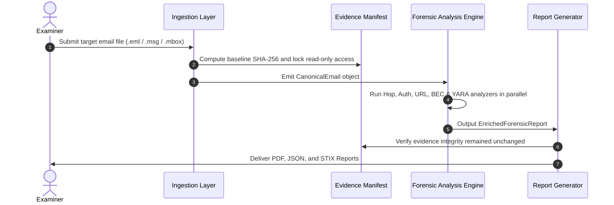

# Email Forensic Tool (EFT) - System Architecture

## 1. High-Level Architecture Overview

The Email Forensic Tool (EFT) is architected following clean, layered design principles for digital forensic readiness: **Immutability of Evidence**, **Determinism**, **Modular Extensibility**, and **Court-Defensible Reporting**.

```
┌─────────────────────────────────────────────────────────────────────────────┐
│                             PRESENTATION LAYER                              │
│   • CLI (Rich Terminal Output)  • Web UI Dashboard  • REST API Endpoints    │
└──────────────────────────────────────┬──────────────────────────────────────┘
                                       │
┌──────────────────────────────────────▼──────────────────────────────────────┐
│                              APPLICATION CORE                               │
│                                                                             │
│  ┌───────────────────────────────────────────────────────────────────────┐  │
│  │                     1. Ingestion & Extraction Layer                   │  │
│  │   • Multi-Format Reader (.eml, .msg, .mbox)                           │  │
│  │   • MIME Tree Decomposer & Character Set Normalizer                   │  │
│  │   • Attachment Extractor, File Typer (Magic Bytes) & Hash Generator   │  │
│  └───────────────────────────────────┬───────────────────────────────────┘  │
│                                      │ Canonical Forensic Object (JSON)      │
│  ┌───────────────────────────────────▼───────────────────────────────────┐  │
│  │                     2. Multi-Vector Analysis Engine                   │  │
│  │  ┌──────────────────────┐  ┌──────────────────────┐  ┌─────────────┐  │  │
│  │  │ Relay & Hop Analyzer │  │ SPF/DKIM/DMARC/ARC   │  │ GeoIP & ASN │  │  │
│  │  └──────────────────────┘  └──────────────────────┘  └─────────────┘  │  │
│  │  ┌──────────────────────┐  ┌──────────────────────┐  ┌─────────────┐  │  │
│  │  │ Link / URL Forensics │  │ BEC & Spoof Detector │  │ YARA Rules  │  │  │
│  │  └──────────────────────┘  └──────────────────────┘  └─────────────┘  │  │
│  └───────────────────────────────────┬───────────────────────────────────┘  │
│                                      │ Enriched Analysis Results             │
│  ┌───────────────────────────────────▼───────────────────────────────────┐  │
│  │                3. Evidence & Reporting Pipeline                       │  │
│  │   • Chain of Custody & Hash Integrity Verification                    │  │
│  │   • Chronological Timeline Builder                                    │  │
│  │   • Exporters: PDF (Executive), JSON (Full Schema), CSV, STIX 2.1     │  │
│  └───────────────────────────────────────────────────────────────────────┘  │
└──────────────────────────────────────┬──────────────────────────────────────┘
                                       │
┌──────────────────────────────────────▼──────────────────────────────────────┐
│                                STORAGE LAYER                                │
│   • Read-Only Evidence Repository                                           │
│   • Local SQLite / Metadata Store for Cases & Cached Threat Intelligence    │
└─────────────────────────────────────────────────────────────────────────────┘
```

---

## 2. Core Subsystems

### 2.1 Ingestion & Normalization Subsystem
* **Purpose:** Ingest raw email files across multiple standards without touching file modified times or altering binary streams.
* **Outputs:** A structured, immutable `CanonicalEmail` model containing:
  - Raw header dictionary + ordered header list
  - Multi-part MIME nodes
  - Plaintext & sanitized HTML bodies
  - Payload attachments with MD5, SHA-1, and SHA-256 digests

### 2.2 Forensic Analysis Subsystem
* **Relay & Route Analyzer:** Parses `Received:` headers in reverse chronological order, measures hop latency, and isolates the true origin IP.
* **Authentication Verifier:** Queries DNS for live SPF and DKIM public keys; validates against recorded `Authentication-Results`.
* **Phishing & Content Inspector:**
  - Extracts all hyperlinks and parses anchor vs. destination mismatches.
  - Detects Unicode homoglyphs and Punycode spoofing.
  - Scans HTML DOM for zero-font, hidden CSS, and invisible tracking pixels.
* **Threat Scanner:** Applies static YARA rules and file type verification against all binary payloads.

### 2.3 Evidence & Reporting Subsystem
* **Chain of Custody:** Generates and validates an `evidence_manifest.json` ensuring cryptographic immutability from input to output.
* **Report Engine:** Converts the enriched forensic case model into PDF reports, structured JSON dumps, and STIX 2.1 intelligence bundles.

---

## 3. Data Flow


