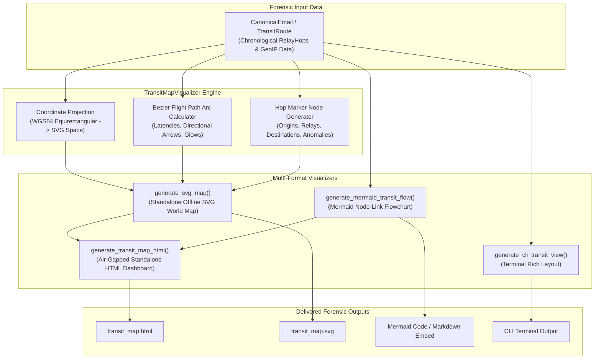

# Pull Request Description: Task 5.2 - Interactive Hop & Transit Map Visualizer

## 📌 1. What We Did
Implemented **Task 5.2: Interactive Hop & Transit Map Visualizer** (Issue #20), advancing **Phase 5 (Epic 5): UI/UX & Visualization Dashboard**.
- Created `TransitMapVisualizer` in `src/eft/ui/map_visualizer.py`:
  - **Interactive World Map (Geographic Routing)**: Standalone, air-gapped vector SVG/HTML world map projection (WGS84 Equirectangular) rendering offline without external map tile servers or CDN dependencies.
  - **Geodesic Flight Path Arcs**: Computes curved bezier arcs connecting consecutive MTA hops with latency intervals, glow filters, direction arrowheads, and anomaly indicators.
  - **Plotted Hop Node Pins**: Interactive markers with color-coded classification (Origin Sender = Blue, Relay MTAs = Purple, Final Recipient = Green, Anomaly = Red) with City, Country, and Hop number badges.
  - **Hop Reconstruction Pipeline**: Chronological sequence cards with metadata (Hostnames, IPs, TLS Encryption status, RFC 1918 Private flags, Tor Exit Node / VPN / Cloud badges, and latency intervals).
  - **Forensic Anomalies Highlighting**: Real-time alerts for clock drifts, negative transit delays, and unauthorized private-to-external jumps.
  - **Mermaid Flowchart Generator (`generate_mermaid_transit_flow`)**: RFC/Mermaid compliant transit graph generator following repository standards (**Mermaid only, NO ASCII art**).
  - **Terminal Native Mode (`generate_cli_transit_view`)**: Constructs a Rich table showing sequential hops, latencies, geo locations, and anomaly tags.
- Exported `TransitMapVisualizer` in `src/eft/ui/__init__.py` and `src/eft/__init__.py`.
- Authored comprehensive test suite `tests/test_map_visualizer.py` verifying coordinate projection, SVG vector paths, Mermaid syntax, HTML generation, and air-gap safety.

---

## ⚙️ 2. How We Did It

### System Architecture / Data Flow Diagram


### Technical Details & Implementation Decisions
1. **Air-Gapped Geographic Projection**: Built-in vector landmass approximations and mathematical Equirectangular projection guarantee that world map rendering works 100% offline in classified/air-gapped forensic labs with 0 external network requests.
2. **Mermaid Standardization**: Adheres strictly to repository guidelines: **NEVER use ASCII art diagrams; ALWAYS use Mermaid diagrams**.
3. **Forensic Anomaly Visualization**: Detected negative transit times (clock drift / time travel) or private routing anomalies are dynamically flagged with red styling across SVG, Mermaid, HTML, and Rich CLI views.

---

## 🎯 3. Why We Did It
Email investigators need to rapidly pinpoint the geographical path and intermediate transmission delays of suspicious messages to detect bulletproof hosting, fast-flux hops, Tor exit nodes, and forged Received headers. Providing unified SVG, HTML, Mermaid, and CLI visualizations ensures seamless analysis in both GUI and headless DFIR environments.

---

## 🧪 4. Testing & Verification

### Test Coverage Results
```
Name                                        Stmts   Miss  Cover
----------------------------------------------------------------
src/eft/ui/map_visualizer.py                  273     15    95%
src/eft/ui/__init__.py                          4      0   100%
src/eft/__init__.py                            28      0   100%
----------------------------------------------------------------
TOTAL (All 33 Modules)                       3739    356  90.48%

============================== 123 passed in 1.22s ==============================
```

### Quality Assurance Verification
- `poetry run ruff check .` -> ✅ Clean (0 issues)
- `poetry run ruff format --check .` -> ✅ Clean (0 issues)
- `poetry run mypy src tests` -> ✅ Clean (51 source files passed)
- `poetry run pytest --cov=src/eft --cov-report=term-missing --cov-fail-under=80` -> ✅ Clean (123 passed, 90.48% coverage)

---

## 🔗 Related Issues & Epics
- Closes #20 (Task 5.2: Interactive Hop & Transit Map Visualizer)
- Part of #18 (Epic 5: UI/UX & Visualization Dashboard)
