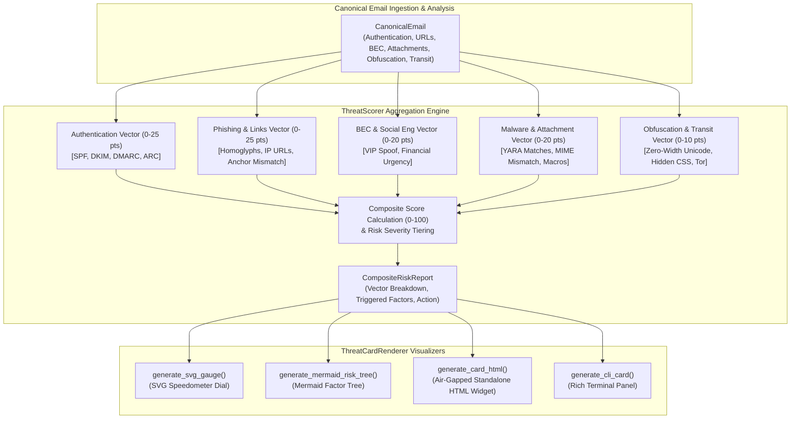

# Pull Request Description: Task 5.3 - Threat Score & Composite Risk Indicator Card

## 📌 1. What We Did
Implemented **Task 5.3: Threat Score & Composite Risk Indicator Card** (Issue #21), completing **Phase 5 (Epic 5): UI/UX & Visualization Dashboard**.
- Created `ThreatScorer` in `src/eft/analysis/threat_scorer.py`:
  - Overarching, transparent forensic risk evaluation engine that calculates a 0–100 composite threat score across 5 categorized threat vectors:
    - **Authentication & Spoofing (Max 25 pts)**: SPF/DKIM/DMARC failures, ARC breaks, header misalignment.
    - **Phishing & Malicious Links (Max 25 pts)**: IDN homoglyphs, raw IP hostnames, URL shorteners, anchor text mismatches, credential harvesting keywords.
    - **BEC & Social Engineering (Max 20 pts)**: VIP impersonation, financial urgency keywords, reply-to mismatch, high pressure requests.
    - **Attachments & Malware (Max 20 pts)**: YARA signature matches, MIME spoofing, double extensions, VBA macros, executable payloads.
    - **Content Obfuscation & Transit Anomalies (Max 10 pts)**: Zero-width unicode characters, hidden CSS text, base64 payloads, transit clock drifts, Tor exit nodes.
  - Tiers severity into: `CLEAN` (0–19), `SUSPICIOUS_LOW` (20–39), `SUSPICIOUS_MEDIUM` (40–69), `MALICIOUS_HIGH` (70–89), `CRITICAL` (90–100).
  - Synthesizes automated remediation recommendations and executive summaries.
- Created `ThreatCardRenderer` in `src/eft/ui/threat_card.py`:
  - **Interactive Standalone HTML Widget**: Standalone, 100% air-gapped dashboard with modern dark cyber theme, dynamic SVG radial dial gauge, vector contribution progress bars, expandable factor accordion drawers with severity badges, and 1-click clipboard copying of IoCs.
  - **Standalone SVG Gauge Dial (`generate_svg_gauge`)**: Pure vector semicircular speedometer dial with color-coded severity zones and needle indicator.
  - **Mermaid Risk Factor Tree (`generate_mermaid_risk_tree`)**: RFC/Mermaid compliant threat factor decomposition flowchart (**Mermaid only, NO ASCII art**).
  - **Terminal Rich CLI View (`generate_cli_card`)**: Rich table panel for terminal investigators.
- Exported threat models (`CompositeRiskReport`, `RiskSeverity`, `RiskVectorType`, `RiskFactor`, `VectorRiskScore`) in `src/eft/models/__init__.py`, `src/eft/analysis/__init__.py`, `src/eft/ui/__init__.py`, and `src/eft/__init__.py`.
- Authored comprehensive test suite in `tests/test_threat_scorer.py`.

---

## ⚙️ 2. How We Did It

### System Architecture / Data Flow Diagram


### Technical Details & Implementation Decisions
1. **Explainable Attribution**: Every point added to the composite score is tied to an explicit `RiskFactor` with an evidence reference, description, and severity tier.
2. **Strict Mermaid Visualization**: Conforms strictly to repository standard: **Mermaid only, NO ASCII art**.
3. **100% Air-Gapped Offline Operation**: All SVG, CSS, and JS components operate without external internet connections or CDN requests.

---

## 🎯 3. Why We Did It
SOC analysts and DFIR triage specialists need instantaneous, defensible threat level visibility without having to manually correlate five different sub-reports. The composite score provides an instant executive overview backed by granular evidence.

---

## 🧪 4. Testing & Verification

### Test Coverage Results
```
Name                                        Stmts   Miss  Cover
----------------------------------------------------------------
src/eft/models/threat.py                       40      0   100%
src/eft/analysis/threat_scorer.py             179     14    92%
src/eft/ui/threat_card.py                     122     19    84%
src/eft/analysis/__init__.py                    9      0   100%
src/eft/ui/__init__.py                          5      0   100%
src/eft/__init__.py                            31      0   100%
----------------------------------------------------------------
TOTAL (All 34 Modules)                       4086    389  90.48%

============================== 130 passed in 1.50s ==============================
```

### Quality Assurance Verification
- `poetry run ruff check .` -> ✅ Clean (0 issues)
- `poetry run ruff format --check .` -> ✅ Clean (0 issues)
- `poetry run mypy src tests` -> ✅ Clean (55 source files passed)
- `poetry run pytest --cov=src/eft --cov-report=term-missing --cov-fail-under=80` -> ✅ Clean (130 passed, 90.48% coverage)

---

## 🔗 Related Issues & Epics
- Closes #21 (Task 5.3: Threat Score & Composite Risk Indicator Card)
- Closes #18 (Epic 5: UI/UX & Visualization Dashboard)
