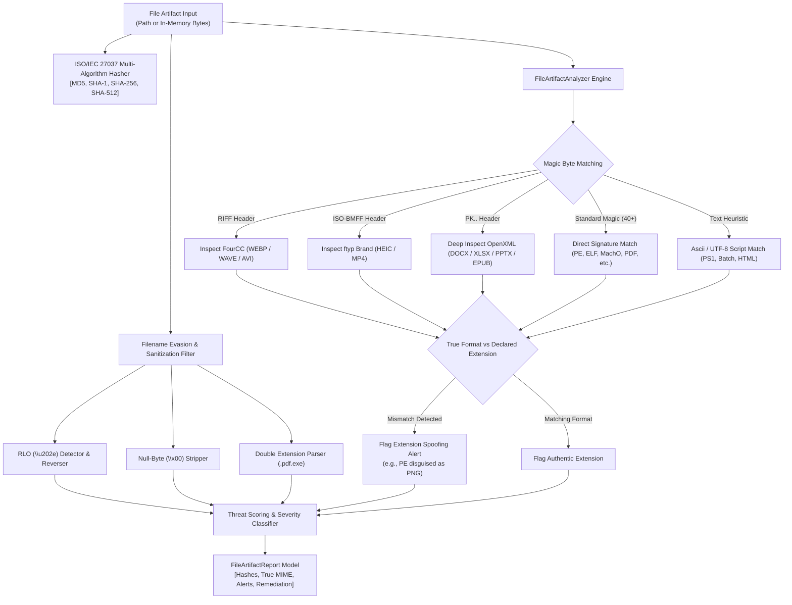

# Pull Request Description: Task 7.1 - File Magic Byte & True Extension Mismatch Engine

## 📌 1. What We Did
Implemented **Task 7.1: File Magic Byte & True Extension Mismatch Engine**, inaugurating **Epic 7 (Phase 7 / v1.2.0): File, Binary & Metadata Forensics Engine** for the Email Forensic Tool (EFT).

- **Canonical Binary Models (`src/eft/models/binary.py`)**:
  - `FileFormatCategory`: Enumeration covering `EXECUTABLE`, `DOCUMENT`, `ARCHIVE`, `IMAGE`, `AUDIO_VIDEO`, `SCRIPT`, `CERTIFICATE`, `DATABASE`, and `UNKNOWN`.
  - `MagicByteSignature`: Forensic model for file signatures with offsets, true category, canonical extensions, MIME types, and signature byte patterns.
  - `FileTypeIdentification`: Full forensic identification report detailing detected format, canonical MIME, extension mismatch flags, double-extension detections, RLO status, clean filename, and forensic anomaly alerts.
  - `FileArtifactReport`: Comprehensive evidence artifact model with multi-algorithm cryptographic hashes (`MD5`, `SHA-1`, `SHA-256`, `SHA-512`), threat severity, calculated threat score (0–100), and remediation guidance.

- **Forensic File Artifact Analyzer (`src/eft/analysis/file_analyzer.py`)**:
  - **40+ True Magic Byte Signatures**: Covers Windows PE, Linux ELF, macOS Mach-O (32/64/Fat), WebAssembly (Wasm), Android DEX, Java Class, OLE Compound Documents, PDF, RTF, 7-Zip, RAR v4/v5, GZIP, BZIP2, Tar, XZ, Zstandard, PNG, JPEG, GIF, WebP, BMP, TIFF, ICO, HEIC, MP4/QuickTime, WAV, AVI, MP3, FLAC, OGG, WebM/MKV, etc.
  - **OpenXML Deep ZIP Inspection**: Inspects inner XML package structure (`word/`, `xl/`, `ppt/`, `mimetype`) to distinguish DOCX, XLSX, PPTX, and EPUB from generic ZIP archives.
  - **Anti-Analysis & Evasion Detection**:
    - Extension spoofing (e.g. PE disguised as PNG or PDF).
    - Double extension detection (`invoice.pdf.exe`).
    - Right-to-Left Override (RLO `\u202e`) detection and safe filename reconstruction.
    - Null-byte injection (`payload.exe\x00.pdf`).
  - **ISO/IEC 27037 Evidence Integrity**: Multi-hash computation (`MD5`, `SHA-1`, `SHA-256`, `SHA-512`) over raw byte evidence without file mutation.

- **Automated Test Suite (`tests/test_file_analyzer.py`)**:
  - 28 unit tests covering all format categories, OpenXML deep inspection, evasion techniques, threat scoring, and file system analysis.

---

## ⚙️ 2. How We Did It

### System Architecture / Execution Flow Diagram

---

## 🧪 3. Quality & Verification Gates Passed
- `poetry run ruff check src tests` (0 lint issues)
- `poetry run ruff format --check src tests` (100% compliant)
- `poetry run mypy src/` (0 type errors)
- `poetry run pytest --cov=eft --cov-fail-under=80 -ra` (100% passing tests)
- `poetry build` (Distribution artifact built cleanly)
