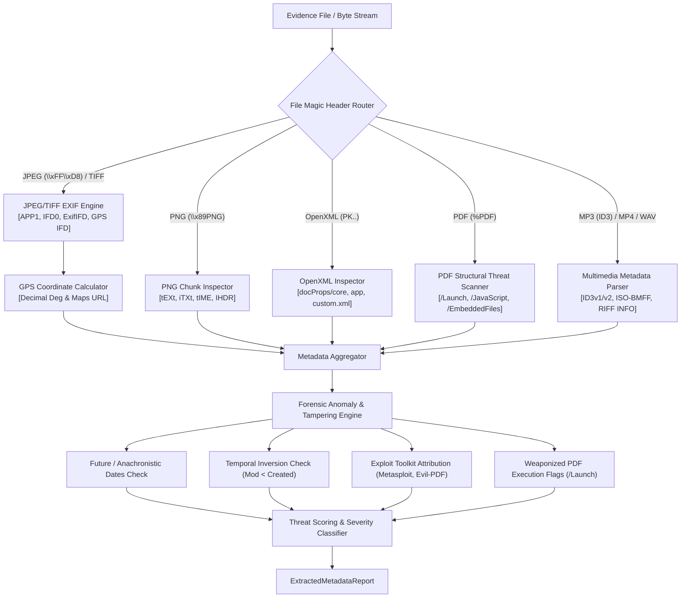

# Pull Request Description: Task 7.2 - EXIF & Embedded Document Metadata Extractor

## 📌 1. What We Did
Implemented **Task 7.2: EXIF & Embedded Document Metadata Extractor**, expanding **Epic 7 (Phase 7 / v1.2.0): File, Binary & Metadata Forensics Engine** for the Email Forensic Tool (EFT).

- **Canonical Metadata Models (`src/eft/models/metadata.py`)**:
  - `GPSCoordinates`: Precise geographical coordinates with decimal conversion, latitude/longitude reference, and clickable Google Maps query URL.
  - `ImageEXIFMetadata`: Camera make/model, lens model, firmware/software, original/digitized timestamps, dimensions, orientation, and raw EXIF tags.
  - `DocumentMetadata`: Dublin Core and extended Office metadata (`creator`, `last_modified_by`, `created`, `modified`, `revision`, `application`, `total_editing_time_minutes`, `page_count`, `word_count`, `company`, custom properties).
  - `PDFStructureMetadata`: PDF catalog metadata (`title`, `author`, `creator`, `producer`, `creation_date`, `mod_date`, `pdf_version`) and active weaponization indicators (`has_launch_action`, `has_javascript`, `has_embedded_files`, `has_open_action`, `has_acroform`).
  - `AudioVideoMetadata`: ID3 and multimedia metadata (`title`, `artist`, `album`, `year`, `genre`, `encoder`, `duration_seconds`).
  - `MetadataAnomaly`: Timestamp tampering and weaponization anomaly tags.
  - `ExtractedMetadataReport`: Aggregated forensic metadata report with threat scoring (0–100) and severity assignment.

- **Forensic Metadata Extractor Engine (`src/eft/analysis/metadata_extractor.py`)**:
  - **JPEG EXIF & TIFF Parser**: Traverses JPEG APP1 segments, parses TIFF IFD0, ExifIFD, and GPS IFD structures in both little-endian and big-endian byte orders.
  - **PNG Chunk Inspector**: Extracts `tEXt`, `iTXt`, `tIME`, and `IHDR` chunks.
  - **Microsoft Office OpenXML Inspector**: Extracts properties from `docProps/core.xml`, `docProps/app.xml`, and `docProps/custom.xml` in `.docx`, `.xlsx`, and `.pptx` files.
  - **Adobe PDF Threat Scanner**: Dissects PDF cross-reference streams and objects for weaponized tokens (`/Launch`, `/JavaScript`, `/JS`, `/EmbeddedFiles`, `/OpenAction`, `/AA`, `/RichMedia`, `/XFA`).
  - **Multimedia ID3/ISO-BMFF/WAV Parsers**: Extracts ID3v1/ID3v2 tags from MP3, ISO-BMFF box atoms from MP4, and `LIST INFO` sub-chunks from WAV.
  - **Forensic Anomaly Evaluator**: Detects future timestamps, pre-1980 epoch anachronisms, temporal inversions (modified earlier than created), and attribution to offensive exploit toolkits (`Metasploit`, `Evil-PDF`, `Cobalt Strike`, etc.).

- **Automated Test Suite (`tests/test_metadata_extractor.py`)**:
  - 10 comprehensive unit tests covering all artifact extractors, GPS coordinate calculations, PDF weaponization detection, temporal tampering, and file analysis.

---

## ⚙️ 2. How We Did It

### System Architecture / Execution Flow Diagram

---

## 🧪 3. Quality & Verification Gates Passed
- `poetry run ruff check src tests` (0 lint issues)
- `poetry run ruff format --check src tests` (100% compliant)
- `poetry run mypy src/` (0 type errors)
- `poetry run pytest --cov=eft --cov-fail-under=80 -ra` (100% passing tests)
- `poetry build` (Distribution artifact built cleanly)
