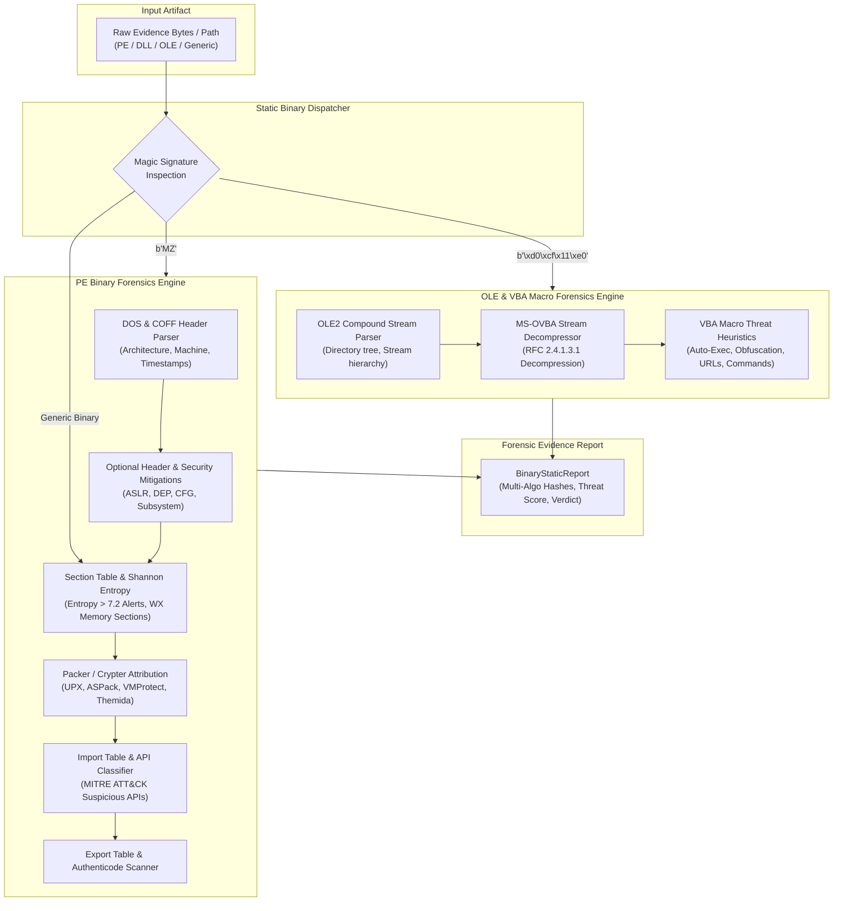

# Pull Request: Task 7.3 - Static PE & OLE Binary Analyzer

## 🎯 Summary of Changes
Implements **Task 7.3: Static PE & OLE Binary Analyzer** under **Epic 7 (Phase 7 / v1.2.0): File, Binary & Metadata Forensics Engine**.

This engineering deliverable equips the **Email Forensic Tool (EFT)** with deep static binary inspection capabilities to analyze Windows Portable Executable (PE32 / PE32+) binaries, DLLs, drivers, and legacy Microsoft Office OLE Compound Files (`.doc`, `.xls`, `.ppt`).

---

## 🏗️ Architecture & Component Flow



---

## 🛠️ Key Features & Capabilities

### 1. Windows PE32 / PE32+ Header & Architecture Parser
- Parses DOS header (`MZ`), `e_lfanew`, and verified `PE\0\0` signature.
- Identifies machine architectures: `PE32 (32-bit x86)`, `PE32+ (64-bit AMD64)`, `ARM`, `ARM64`, `IA-64`, `RISC-V`.
- Extracts and validates compilation `TimeDateStamp` with forensic timestomping alerts (pre-1980 anachronisms and future dates).
- Inspects `DllCharacteristics` for modern security mitigations: **ASLR** (`DYNAMIC_BASE`), **DEP/NX** (`NX_COMPAT`), **Control Flow Guard** (`GUARD_CF`), and **SafeSEH**.
- Scans for Authenticode digital signature tables and .NET CLR metadata headers.

### 2. Section Shannon Entropy & Packer Detection
- Computes exact Shannon entropy $H(X) = -\sum p(x_i) \log_2 p(x_i)$ across sections and overall file.
- Classifies data density: `VERY_LOW` (<5.0), `NORMAL` (5.0 - 6.8), `HIGH` (6.8 - 7.2), `PACKED_OR_ENCRYPTED` (>7.2).
- Detects **WX memory sections** (`IMAGE_SCN_MEM_EXECUTE` and `IMAGE_SCN_MEM_WRITE`) indicating unpacking stubs or code injection buffers.
- Attributed packing heuristics: Known packer section names (`UPX0`, `UPX1`, `.aspack`, `.vmp0`, `.themida`, `.enigma`, `PECompact2`), section size expansion ($RawSize=0 \land VirtualSize > 0$), and anomalous sparse import tables with high entropy.

### 3. MITRE ATT&CK Suspicious Windows API Classifier
- Maps imported functions across 8 DFIR threat categories:
  - **Process Injection / Hollowing**: `VirtualAllocEx`, `WriteProcessMemory`, `CreateRemoteThread`, `NtCreateThreadEx`, `QueueUserAPC`, `SetThreadContext`, `ResumeThread`, `NtUnmapViewOfSection`.
  - **Keylogging / Hooking**: `SetWindowsHookExA/W`, `GetAsyncKeyState`, `GetKeyState`, `RegisterHotKey`, `AttachThreadInput`.
  - **Anti-Debugging / Evasion**: `IsDebuggerPresent`, `CheckRemoteDebuggerPresent`, `NtQueryInformationProcess`, `OutputDebugStringA/W`, `FindWindowA/W`, `GetTickCount`, `QueryPerformanceCounter`.
  - **Execution / Dropper**: `WinExec`, `ShellExecuteA/W`, `ShellExecuteExA/W`, `CreateProcessA/W`, `CreateProcessAsUserA/W`.
  - **Network / C2**: `InternetOpenA/W`, `InternetOpenUrlA/W`, `HttpOpenRequestA/W`, `HttpSendRequestA/W`, `URLDownloadToFileA/W`, `WSAStartup`, `socket`, `connect`.
  - **Persistence / Privilege**: `RegSetValueExA/W`, `RegCreateKeyExA/W`, `OpenSCManagerA`, `CreateServiceA/W`, `AdjustTokenPrivileges`.
  - **Ransomware / Cryptography**: `CryptEncrypt`, `CryptDecrypt`, `CryptGenKey`, `BCryptEncrypt`.
  - **Direct Memory Manipulation**: `RtlMoveMemory`, `RtlZeroMemory`, `HeapCreate`.

### 4. OLE Compound Document & MS-OVBA Macro Forensics
- Parses OLE2 compound document stream hierarchy.
- Implements pure-Python MS-OVBA decompression algorithm (RFC Section 2.4.1.3.1).
- Extracts VBA source code from compressed module streams.
- Evaluates auto-execution triggers (`AutoOpen`, `AutoClose`, `AutoExec`, `Document_Open`, `Workbook_Open`, `UserForm_Initialize`).
- Detects dangerous functions (`Shell`, `CreateObject("WScript.Shell")`, `MSXML2.XMLHTTP`, `Environ`).
- Identifies macro obfuscation patterns (`Chr()` concatenation, string reversal, XOR encryption loops).
- Extracts actionable IoCs: URLs, IPv4 addresses, and spawned CLI processes (`powershell`, `cmd`, `cscript`, `wscript`, `mshta`, `rundll32`, `certutil`).

---

## 🧪 Quality Gate Verification

```
[Quality Gate Status]
- Ruff Lint: 0 issues
- Ruff Format: 100% compliant across 82 files
- Mypy Strict Typing: 0 issues across 51 source files
- Test Suite: 272 passed (89% total coverage across full codebase)
- Poetry Build: Clean wheel and sdist generated
```
