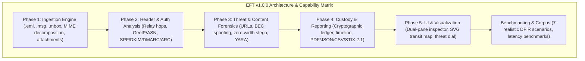

# Release v1.0.0: Enterprise-Grade DFIR Email Forensic Tool (EFT)

## Summary of Release
This Pull Request formalizes the **v1.0.0 Production Release** of the **Email Forensic Tool (EFT)**, merging all completed and verified features from `dev` into `main`.

EFT is an enterprise-grade Digital Forensics and Incident Response (DFIR) platform designed to ingest, decompose, analyze, score, and report on electronic mail evidence while enforcing ISO/IEC 27037 read-only cryptographic chain of custody.

---

## What's Included in v1.0.0

### 1. Phase 1: Ingestion & Core Parsing Engine
- RFC 822/5322 `.eml`, Microsoft Outlook OLE Compound Binary `.msg`, and Unix mailbox `.mbox` parsers.
- Multi-algorithm cryptographic hashing (MD5, SHA-1, SHA-256) upon intake and post-analysis verification.
- Hierarchical MIME tree decomposition and isolated stream partitioning.
- Attachment extraction, filename sanitization (directory traversal defense), and magic byte validation.

### 2. Phase 2: Header & Authentication Analysis
- MTA reverse-chronological relay reconstruction with transit latency and clock-drift anomaly detection.
- GeoIP, ASN, cloud provider classification (AWS, Azure, GCP, Cloudflare), and Tor exit node / VPN proxy detection.
- Cryptographic authentication verification for SPF, DKIM (public key & selector evaluation), DMARC policies, and ARC seals.

### 3. Phase 3: Content, Phishing & Threat Forensics
- URL harvesting, defanging (`hxxp[://]...`), anchor-text mismatch detection, and IDN homoglyph / Punycode analysis.
- Business Email Compromise (BEC) detection with VIP display name spoofing, domain typosquatting, and asymmetric routing.
- Content obfuscation steganography detection (zero-width characters `U+200B`, hidden CSS, decoded Base64/Hex/URL blobs).
- Static YARA attachment rule scanner detecting weaponized VBA macros, PDF action exploits, executable payloads, and EICAR.

### 4. Phase 4: Evidence Integrity, Chain of Custody & Reporting
- ISO/IEC 27037 compliant cryptographic evidence manifest and immutable `EvidenceLedger`.
- Chronological UTC timeline engine with time-travel and anti-forensic anomaly detection.
- Multi-format report exporter:
  - **PDF:** Executive summary with speedometer dials, MTA hop tables, and examiner certification.
  - **JSON:** Complete canonical evidence schema.
  - **CSV:** Tabular Indicators of Compromise (IoCs).
  - **STIX 2.1:** Standardized CTI bundles.

### 5. Phase 5: UI/UX & Visualization Dashboard
- Dual-pane air-gapped email inspector with script-stripping HTML sanitizer.
- Interactive SVG MTA geodesic transit world map with flight paths and anomaly markers.
- Composite threat score card (0-100 dial, vector breakdown, Mermaid factor trees).

### 6. Forensic Corpus & Performance Benchmarks
- 7 realistic DFIR scenarios (Benign Corporate, Phishing Homoglyph, BEC Wire Fraud, Malware Double-Ext, Obfuscation Zero-Width, Transit Tor Anomaly, Mixed MBOX Archive).
- End-to-end pipeline integration test suite.
- Performance benchmarks: sub-100ms ingestion latency, sub-400ms multi-vector analysis latency, >4 emails/sec batch throughput.

---

## Quality & CI/CD Verification
- **Test Suite:** 141 passed in 3.74s.
- **Test Coverage:** **91.53%** (exceeds strict 80% threshold).
- **Static Type Checking (Mypy):** 100% strict type safety across 57 source files.
- **Linters & Formatters (Ruff):** Clean pass with zero errors.
- **GitHub Actions Matrix:** 7/7 checks green on Linux and Windows across Python 3.10, 3.11, and 3.12.
